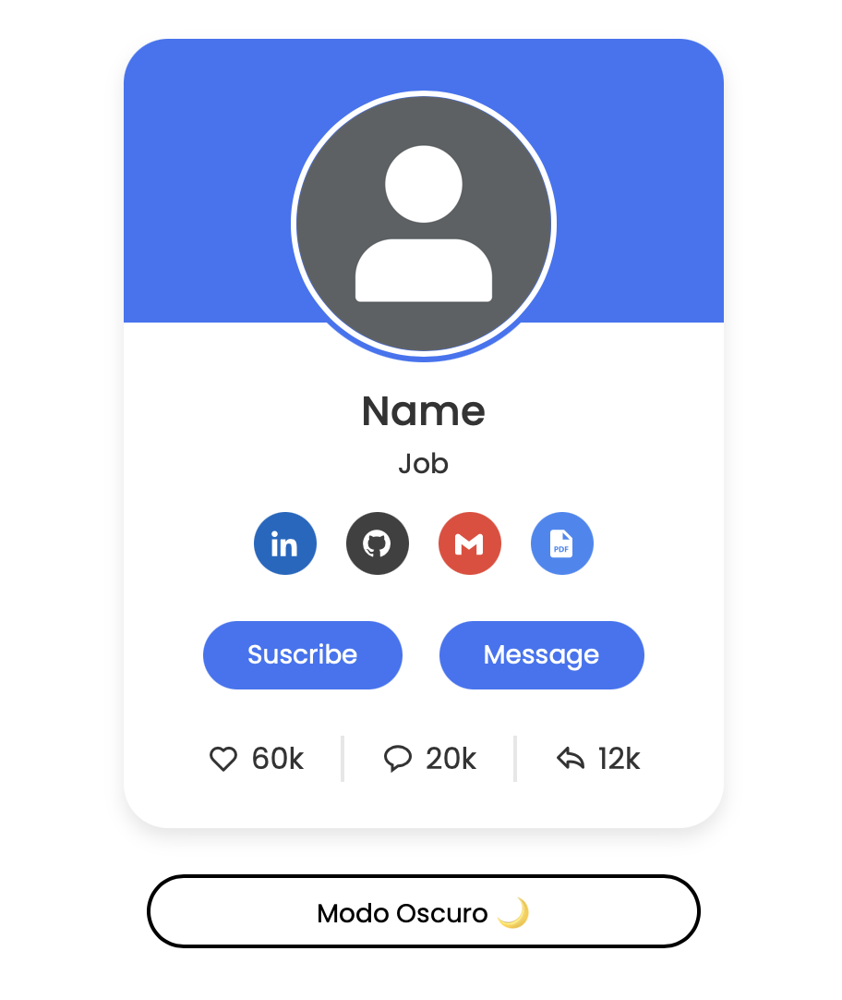
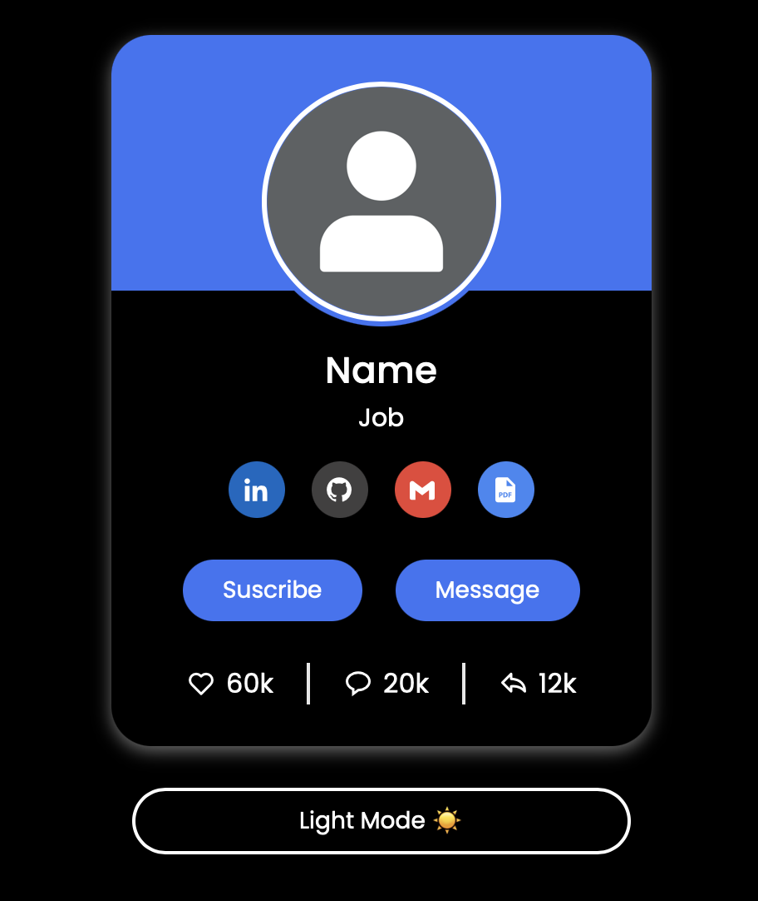

# 🎨 Profile Card UI Design  

Este es un diseño moderno y responsive de una **tarjeta de perfil** con enlaces a redes sociales y botones interactivos.  

## 🚀 Demo en Vivo  
🔗 [Ver Proyecto en Vercel](https://profile-card-two-theta.vercel.app)  

## 📸 Vista Previa  

## 🛠️ Tecnologías Usadas  
- **HTML5** 🏗️  
- **CSS3** 🎨  
- **Boxicons** (Para iconos) 🔣  
- **JavaScript** ⚡ (Para interactividad)  
